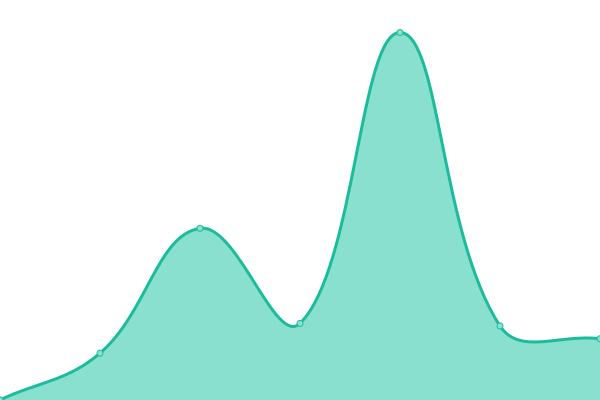

# [📈 Live Status](https://uqbar-dev.github.io/upptime): <!--live status--> **🟧 Partial outage**

This repository contains the open-source uptime monitor and status page for [Uqbar](https://www.uqbar.com.br), powered by [Upptime](https://github.com/upptime/upptime).

With [Upptime](https://upptime.js.org), you can get your own unlimited and free uptime monitor and status page, powered entirely by a GitHub repository. We use [Issues](https://github.com/uqbar-dev/upptime/issues) as incident reports, [Actions](https://github.com/uqbar-dev/upptime/actions) as uptime monitors, and [Pages](https://uqbar-dev.github.io/upptime) for the status page.

<!--start: status pages-->
<!-- This summary is generated by Upptime (https://github.com/upptime/upptime) -->
<!-- Do not edit this manually, your changes will be overwritten -->
<!-- prettier-ignore -->
| URL | Status | History | Response Time | Uptime |
| --- | ------ | ------- | ------------- | ------ |
|  [Tlon Widget](https://www.tlon.com.br/index.php?option=com_widgets&usrid=0GZYWbGpezpMMLkcOBVUnDeIgxtaTKAOQzh&usrkey=h2nxBiINVtYxDZOXIr3qYufZipZwBt9iQnB) | 🟥 Down | [tlon-widget.yml](https://github.com/uqbar-dev/upptime/commits/HEAD/history/tlon-widget.yml) | 

 0ms
     
 | 

<a href="https://uqbar-dev.github.io/upptime/history/tlon-widget">0.00%</a>
    

|  [Plataforma Uqbar](https://www.uqbar.com.br/plataforma) | 🟩 Up | [plataforma-uqbar.yml](https://github.com/uqbar-dev/upptime/commits/HEAD/history/plataforma-uqbar.yml) | 

 356ms
     
 | 

<a href="https://uqbar-dev.github.io/upptime/history/plataforma-uqbar">99.48%</a>
    

|  [Home Uqbar](https://www.uqbar.com.br) | 🟩 Up | [home-uqbar.yml](https://github.com/uqbar-dev/upptime/commits/HEAD/history/home-uqbar.yml) | 

 782ms
     
 | 

<a href="https://uqbar-dev.github.io/upptime/history/home-uqbar">100.00%</a>
    

|  [Anuarios Uqbar](https://anuarios.uqbar.com.br) | 🟩 Up | [anuarios-uqbar.yml](https://github.com/uqbar-dev/upptime/commits/HEAD/history/anuarios-uqbar.yml) | 

 433ms
     
 | 

<a href="https://uqbar-dev.github.io/upptime/history/anuarios-uqbar">100.00%</a>
    

|  [Uqbar Sentry](https://sentrysrv.uqbaronline.com/auth/login/sentry/) | 🟩 Up | [uqbar-sentry.yml](https://github.com/uqbar-dev/upptime/commits/HEAD/history/uqbar-sentry.yml) | 

 463ms
     
 | 

<a href="https://uqbar-dev.github.io/upptime/history/uqbar-sentry">100.00%</a>
    

|  [Nocodb](https://nocodb.uqbaronline.com/) | 🟩 Up | [nocodb.yml](https://github.com/uqbar-dev/upptime/commits/HEAD/history/nocodb.yml) | 

 306ms
     
 | 

<a href="https://uqbar-dev.github.io/upptime/history/nocodb">100.00%</a>
    

|  [Briefer](https://briefer.uqbaronline.com/) | 🟩 Up | [briefer.yml](https://github.com/uqbar-dev/upptime/commits/HEAD/history/briefer.yml) | 

 223ms
     
 | 

<a href="https://uqbar-dev.github.io/upptime/history/briefer">100.00%</a>
    

|  [Japeri](https://japeri.uqbar.com.br/admin/) | 🟥 Down | [japeri.yml](https://github.com/uqbar-dev/upptime/commits/HEAD/history/japeri.yml) | 

 367ms
     
 | 

<a href="https://uqbar-dev.github.io/upptime/history/japeri">95.30%</a>
    

|  [CRM - Vtiger](https://crm.uqbar.com.br/) | 🟩 Up | [crm-vtiger.yml](https://github.com/uqbar-dev/upptime/commits/HEAD/history/crm-vtiger.yml) | 

 466ms
     
 | 

<a href="https://uqbar-dev.github.io/upptime/history/crm-vtiger">100.00%</a>
    

<!--end: status pages-->

[**Visit our status website →**](https://uqbar-dev.github.io/upptime)

## 📄 License

- Powered by: [Upptime](https://github.com/upptime/upptime)
- Code: [MIT](./LICENSE) © [Uqbar](https://www.uqbar.com.br)
- Data in the `./history` directory: [Open Database License](https://opendatacommons.org/licenses/odbl/1-0/)
